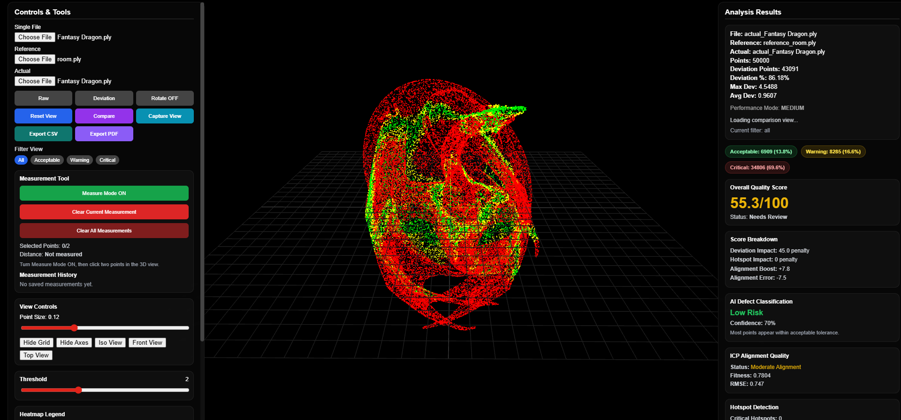

<!-- HEADER -->

  

  <b>AI-powered system to detect construction defects using 3D point cloud data</b>

  
  

---

## 🧠 Overview

The **3D Point Cloud QA System** is designed to automate construction quality inspection by comparing **as-built scans** with expected models.

Instead of manual inspection, this system:
- Detects deviations automatically  
- Visualizes issues in real time  
- Helps teams identify critical defects faster  

---

## ❗ Problem

Traditional construction QA is:
- Manual and time-consuming  
- Error-prone  
- Lacks real-time visualization  

There is no simple way to:
- Compare real-world scans with design models  
- Detect structural deviations instantly  
- Prioritize critical issues  

---

## 💡 Solution

This system provides:

✔ Automated deviation detection  
✔ Real-time 3D visualization  
✔ Heatmap-based defect highlighting  
✔ Measurement tools for validation  

---

## 🚀 Key Features

### 🔴 Deviation Heatmap
- Highlights errors using color codes:
  - Green → Acceptable  
  - Yellow → Warning  
  - Red → Critical  

---

### 📏 Measurement Tools
- Measure distances and alignment directly in 3D space  
- Enables accurate validation of structures  

---

### 🔄 ICP-Based Alignment
- Uses Iterative Closest Point (ICP) algorithm  
- Aligns scanned data with reference model  

---

### ⚡ Interactive 3D Viewer
- Built using Three.js  
- Smooth rotation, zoom, and navigation  

---

### 🎯 Threshold Classification
- Automatically categorizes deviations  
- Helps prioritize critical issues  

---

## 🛠️ Tech Stack

**Frontend**
- React.js  
- Three.js  

**Backend**
- FastAPI  
- Python  

**Processing**
- Open3D  
- ICP Algorithm  

---

## 🧩 Architecture

User Upload → Backend (FastAPI)
            → Point Cloud Processing (Open3D)
            → Alignment (ICP)
            → Deviation Calculation
            → API Response
            → Frontend Visualization (Three.js)

## 📊 Impact

- Reduced manual inspection effort by ~40%  
- Improved defect detection accuracy  
- Enabled faster decision-making through visualization  

---

## Future Improvements

- Real-time point cloud streaming
- AI-based defect classification
- BIM model integration
- Performance optimization for large datasets

---

## 👩‍💻 Author

Shahista Tamkeen
- LinkedIn: https://www.linkedin.com/in/shahista-tamkeen/
- Portfolio: https://shahistatamkeen1.github.io/portfolio/

## 🖼️ Demo Preview

---